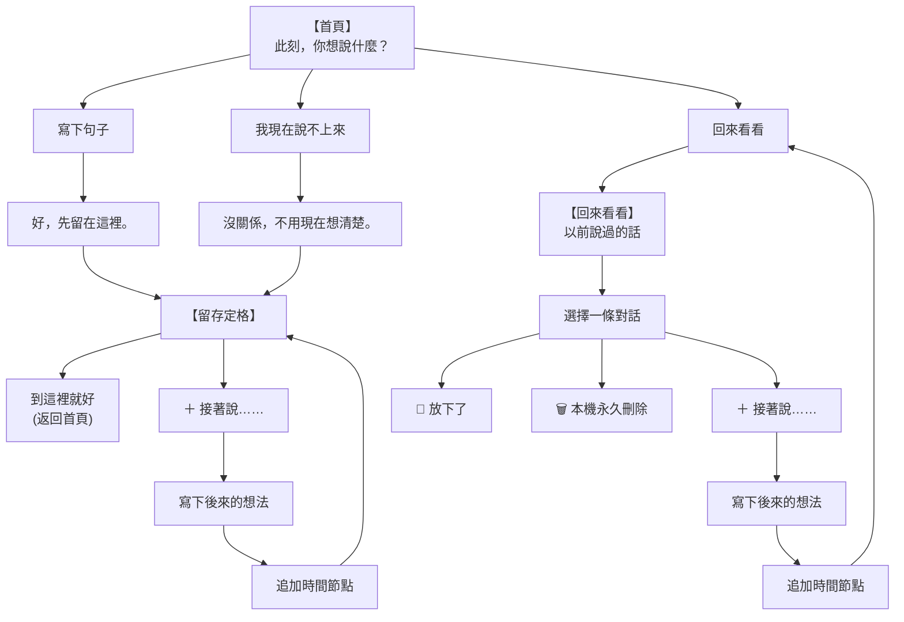

# 思緒停靠 (Mind Harbor) — 產品憲法 (Self-Dialogue Charter v2)

> **「思緒停靠是一個讓你可以跟自己慢慢說下去的地方。不要求結論，只保留對話可以繼續的可能。」**

---

# 1. 核心願景與最高原則

它不是記事本。  
不是 Todo App。  
不是習慣追蹤器。  
不是心智圖。  
也不是替使用者分析心理的工具。

思緒停靠是一個：

> **低負擔的自我對話空間（Low-friction Self-dialogue Space）**

產品的核心哲學是：

> **讓此刻說出口的話，有一個可以在未來繼續的位置。**

### 核心原則：
1. **說出來，不強求完整**：此刻想說什麼就寫什麼；甚至只有「不知道」或「我現在說不上來」也完全足夠。
2. **留下來，不強求行動**：不替對話設下一步或結論；留下來即可結束，沒有未完成的焦慮。
3. **回來看看，接著說**：跨時間重新遇見以前自己說過的話，有新的想法就繼續補上時間痕跡。
4. **你可以停在任何地方**：零紅點、零推播、零完成率要求，把注意力與主導權完全還給生活。

---

# 2. 時間性展開 vs 空間性整理

* **心智圖 / 筆記 App**：把想法展開成「空間結構」（分類、節點、關聯、樹狀階層）。
* **思緒停靠**：讓想法沿著「時間」自然展開（線性時間痕跡）。

```text
8/26 23:10
最近一直覺得很煩，但又不知道到底在煩什麼。
   ↓
8/27 14:30
今天突然發現，其實我很怕那個會議。
   ↓
8/29 22:10
現在想想，我好像不是怕會議，我是怕被否定。
   ↓
＋ 接著說……
```

使用者不需要在第一次說話時就知道全貌。思考本來就是在不同時間點緩慢湧現的。

---

# 3. 核心資料模型 (Data Schema)

系統以「對話線程（Thread）」為單位，每個節點皆為客觀的時間事件：

```typescript
export type DialogueEntry =
  | {
      id: string;
      timestamp: number;
      type: "text";
      content: string;
    }
  | {
      id: string;
      timestamp: number;
      type: "unspoken";
    };

export interface ThoughtThread {
  id: string;
  createdAt: number;
  updatedAt: number;
  isReleased?: boolean;
  entries: DialogueEntry[];
}
```

### 「說不上來 (unspoken)」的客觀性：
`type: "unspoken"` 僅代表一件客觀事實：**使用者在該時間點選擇了「我現在說不上來」**。  
系統不對其進行心理學詮釋，也不將其視為「未填寫的空格」，它本身就是一個完整的起點。

---

# 4. 兩條極簡主路徑



---

# 5. 核心互動規範

1. **零決策摩擦**：首頁輸入後直接留存，不再要求做「先放著 / 帶走一小步」的選擇題。
2. **「＋ 接著說」是一等公民**：無論是在當下定格頁，還是在「回來看看」頁面，「＋ 接著說」皆是延伸對話的核心動作。
3. **放下的意義**：代表「這段對話可以停在這裡了」，保留時間痕跡，不形成成績或統計。
