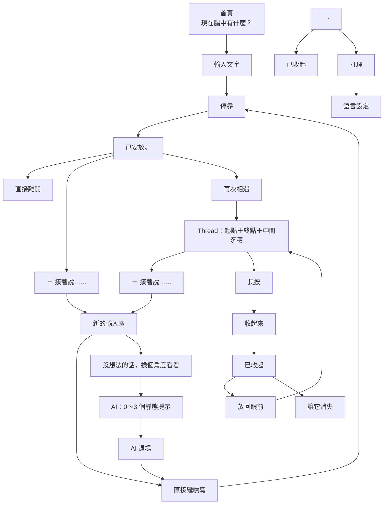

# 思緒停靠 (Mind Harbor) V7.2 — 01～19 正式定案規格

> **「腦中的事，不一定現在就要想清楚。」**

---

# 一、01～19 已定案規格架構

## 01｜首頁輸入與「停靠」
* **核心問題（主標題）**：`現在腦中有什麼？`
* **寫作許可（副標題）**：`想法、感覺，或只是突然想到的一件事，都可以。`（提供寫作起筆入口，拒絕元認知分類）
* **首頁不顯示**：歷史內容、Streak、字數、完成率、任務進度、AI Insight、未完成提醒、心情統計。
* **輸入框 Placeholder**：`寫下此刻想留下的任何一句話……`
* **四個快速輸入**（跨過空白，非分類標籤）：
  * `今天有點累`
  * `有件事讓我在意`
  * `今天有件事很開心`
  * `突然想到一件事`
* **主要按鈕**：`停靠`

## 02｜AI 入口
* **首頁不顯示 AI**：首頁不提供 AI，輸入文字時亦不出現。
* **有第一個文字念頭後**：具備使用條件。
* **AI 入口文案**：`沒想法的話，換個角度看看`（可選輔助入口，非必做，非卡住判斷）。

## 03｜停靠完成狀態與時序（環境散去＋單點沉落＋二段式觸覺）
* **停靠儀式時序 (Ceremony Timing Sequence)**：
  1. `0.0s`：使用者點擊「停靠」 $\rightarrow$ Input Blur，Keyboard Dismiss，觸發第一段脫扣微震（`15ms unlatch`）。
  2. `0.0s ～ 0.3s`：周圍輔助元素（標題、副標、標籤、按鈕）快速淡出（`Ambient Dissolve`），畫面留白。
  3. `0.3s ～ 2.0s`：文字單點居中，緩慢縮小至 `scale(0.25)`（25% 尺寸）並沉降 64px（`Solitary Sink`）。
  4. `2.0s`：文字落入卡槽瞬間，觸發第二段深沉微震（`[30, 40, 20] docking`），卡片實體化接住思緒。
  5. `2.0s ～ 2.8s`：「放在這裡了。」平靜淡入。
  6. `2.8s ～ 3.8s`：安靜停留，隨後提示文字平滑淡出，卡片永久留存。
* **中斷規則 (Interrupt Rule)**：
  若使用者點擊「＋ 接著說……」，提示立即淡出，輸入框重新 Focus 並喚起鍵盤。
* **核心原則**：鍵盤收起、環境散去、文字孤立慢速沉落至 25%、落底咬合觸覺、提示短暫存在、卡片永久確認。

## 04｜「＋ 接著說……」
* 代表如果還有話可以繼續，非必經步驟。
* 新內容接續同一 Thread，可再次停靠。
* 平行選項：繼續寫 或「沒想法 $\rightarrow$ 換個角度看看」。

## 05｜AI 使用週期
* **每一個停靠週期，AI 最多使用一次**。
* 最多 4 個提示 $\rightarrow$ AI 退場。
* 不重新生成、不刷新、不換一組、不再次叫出。
* 防止形成無限 AI 對話。

## 06｜Thread｜起點＋終點＋中間沉積
* **三明治結構**：預設只保留「第 1 則：起點」與「最後 1 則：終點」。
* 中間內容沉積以 `···` 表示（不用「+4 則」、「共 6 則」）。
* 主動點開後完整展開所有 Entry。

## 07｜再次相遇
* **入口**：`再次相遇`。
* **段落式時間流（拒絕氣泡方塊）**：嚴禁採用聊天氣泡（Chat Bubble），避免形成即時對話或與機器人聊天的心理暗示；視覺呈現如同一張按時間自然向下生長的安靜活頁紙。
* **三層間距階層 (Spacing Hierarchy)**：
  * **同一 Thread 內部 Entry**：`12px - 16px`（緊湊聚合，末端掛上唯一的 `＋ 接著說……`）。
  * **不同獨立 Thread 之間**：`32px - 40px`（淡灰分隔細線或呼吸留白，清晰區隔不同事件）。
  * **日期分組之間**：`48px - 64px`（大層級換日）。
* **去管理化時間線**：進入後無多餘報表感標題，僅保留平靜返回。
* **去卡片框線**：內容自然浮在畫面上（留白、字級、時間、段落）。
* **日期自然化**：`8 月 30 日`，當天為 `今天`。
* **不提供管理工具**：不主動提供搜尋、分類、篩選、標籤、統計、趨勢分析。
* **最後一則留言容錯修改**：Thread 末端最後一則 Entry 支援點擊「修改」，供修正錯字與即時後悔，保存歷史時序的同時提供必要彈性。

## 08｜「我現在說不上來」
* 完整合法的停靠狀態。
* 點擊：`看見了。` $\rightarrow$ `先放在這裡。`
* 保存底層：`state: ineffable, timestamp, thread_root: true`。
* 「再次相遇」顯示：`說不上來……`，未來仍可 `＋ 接著說……` 接續。

## 09｜「收起來」語言
* 移除舊詞彙：封存、封存區、刪除、還原。
* 正式改用：
  * **收起來**（移出目前視線）
  * **已收起**（已離開主要時間線）
  * **放回眼前**（回到正常時間線）
  * **讓它消失**（確認不再保留於此裝置）
* **已安放 vs 收起來**：已安放為停靠完成；收起來為日後主動移出視線。

## 10｜內容保存與生命週期
* **永遠保留**：已安放內容預設永遠存在。
* 不提供保存期限設定（無 7 天 / 30 天 / 到期設定）。
* **資料位置**：本機保存為原則。
* **唯一正式移除流程**：`已安放` $\rightarrow$ `收起來` $\rightarrow$ `已收起` $\rightarrow$ `讓它消失`。

## 11｜App 關閉／重新開啟
* **零彈窗、零挽留**：未按「停靠」前離開不形成正式 Entry。
* 重新開啟直接回到「現在腦中有什麼？」，不提示還原未完成文字。

## 12｜Thread 成立與延續
* 第一次停靠建立 Root Entry。
* 「＋ 接著說……」永遠接在該 Thread 最後（不允許中間插入）。
* 不因時間（24小時/7天/30天）自動切斷 Thread。

## 13｜Entry 閱讀狀態
* 極簡純淨，內容為主角。
* 核心操作僅保留 `＋ 接著說……`。
* 不常駐顯示功能按鈕。

## 14｜「接著說」中的 AI
1. **進入接著寫**：輸入框下顯示「· 沒想法的話，換個角度看看」與「停靠」。
2. **使用 AI 後**：入口立即消失，無聲出現最多 3 句提示。
3. **停靠後**：AI 提示立即消失，不保存、不進 Thread。
4. **動態視區**：鍵盤喚起時確保提示與游標於舒適視區。

## 15｜AI 提示生成哲學與 Safety
* **唯一任務**：提供最多 4 個可接續的文字入口（句子起手式優先）。
* **核心視角維度**：
  * **近｜焦點伸展**：探索最直接的感受、瞬間、亮點或核心動機。
  * **中｜抽離期待**：抽離外界眼光、他人標準或自我限制。
  * **遠｜尺度放寬**：時間拉長、收縮至眼前最小一步、允許暫時停留或安放。
* **0～4 句原則**：不足以產生有意義視角時回傳 Empty，安靜不硬湊。
* **Safety Gate**：高風險內容由獨立 Safety UX 接住，不套用提示生成。

## 16｜AI 上下文讀取範圍
* **AI 只讀取當前正在處理的最新 Entry**。
* 不讀取同 Thread 歷史 Entry、更早紀錄或過去模式。
* Thread 是使用者的記憶結構，非 AI 的記憶結構。

## 17｜「收起來」入口
* 主畫面不常駐收起來按鈕。
* 右上角提供低存在感 `···` 隱形抽屜：內含 `已收起` 與 `打理`。
* Entry 操作透過「長按」呼叫。

## 18｜已收起空間
* 獨立安靜空間，頂部 `← 回去` / `已收起`。
* 每則 Entry 直接提供「放回眼前」與「讓它消失」兩個低對比 Ghost Button（1px 淡框、透明底、圓角 6px、大觸控熱區）。
* 在已收起內容點擊「＋ 接著說……」產生之新 Entry 會**回到正常時間線**。

## 19｜「打理」
* 目前僅提供語言設定（預設 `繁體中文`）。
* 不堆放其他設定與開關。

---

# 二、整體心智流向

---

# 三、核心精神總結

> **你可以寫。**
> **可以停靠。**
> **可以什麼都不做。**
> **可以接著說。**
> **沒想法時，可以叫 AI 給你幾個入口。**
> **AI 只給入口，不替你走。**
> **內容可以一直留著。**
> **不想看了，可以收起來。**
> **真的不要了，才讓它消失。**
> **即使說不上來，也算一次完整的停靠。**
> 
> **腦中的事，不一定現在就要想清楚。**

