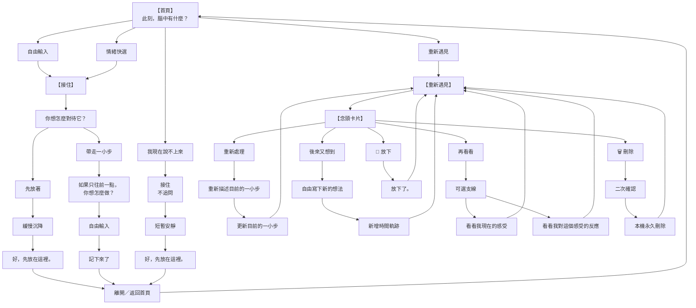

# 思緒停靠 (Mind Harbor) — 核心主旨與產品憲法

> **「思緒停靠不替你整理人生。它只把當下腦中的念頭接住，讓你決定現在要放著、往前一步，或什麼都不做；如果後來又想到什麼，你可以回來接著寫，但系統不會替你把這些念頭變成一套人生管理系統。」**

---

# 0. 本文件的三種語句

本文件中的內容分成三種性質：

### 產品原則

經過反覆檢驗、邏輯自洽，作為所有功能與設計判斷的最高依據。

### 設計限制

為了實現產品原則而訂定的具體規範，工程、UX、UI 與資料設計必須遵守。

### 待驗證假設

邏輯上合理，但尚未經真實使用者資料驗證的設計猜測。

待驗證假設不得被描述成產品已經證明的事實。

> **不知道，就是不知道。**
>
> 產品規格不以更肯定的語氣掩蓋未知，而應明確標示未知。

---

# 1. 核心願景與最高原則

它不是記事本。

不是 Todo App。

不是習慣追蹤器。

也不是替使用者分析心理的工具。

它是一個讓念頭暫時有地方停靠、讓人可以決定如何對待它的容器。

**思緒停靠** 的核心哲學是：

> **非生產力取向的認知減載空間（Cognitive Offloader）**

產品的能力，不在於替使用者多做什麼，而在於：

> **知道什麼應該由系統承擔，什麼應該留給使用者自己。**

因此，產品不是單純追求「少做」。

而是：

> **只做足以讓使用者放下的事，不多做。**

---

# 1.1 四個對稱邊界

這四句是目前產品最高層級的設計邊界。

## ① 接住，但不留住

系統負責接住當下的注意力負荷，但不得利用下一步、推薦、通知、歷史或其他機制把使用者留在產品裡。

UX 上：

* 零阻力輸入；
* 清楚的承接回應；
* 停靠完成後介面動能歸零；
* 離開始終是充分的選擇。

---

## ② 承接，但不接管

系統可以幫忙穩住當下的混亂，但不替使用者管理人生。

不得：

* 建立任務樹；
* 排程；
* 自動分派責任；
* 強制提醒；
* 代替使用者做決策；
* 將自然語言拆成複雜結構。

產品提供容器，不接手人生。

---

## ③ 記錄，但不宣稱

系統可以忠實保存使用者留下的內容與事件，但不得把「記下」宣稱成「做到」。

尤其：

> **帶走一小步 ≠ 行動已完成。**

系統可以保存：

> 「我想傳訊息給主管。」

但不得顯示：

> 「你已經處理好了。」

因為系統不知道現實中的行動是否真的發生。

---

## ④ 可達，但不召喚

使用者需要時，產品應該容易找到。

但產品不得主動索取注意力。

可以提供：

* App 入口；
* Widget；
* 快捷入口；
* 系統層級的快速輸入方式。

不得使用：

* 推播催促；
* 紅點；
* 未完成提醒；
* 情緒式召喚；
* 連續使用提示；
* 回訪誘導。

> **入口存在，但不拉人。**

---

# 1.2 三個核心動作

## ① 接住

> **「此刻，腦中有什麼？」**

首頁第一視覺權重必須始終屬於「此刻」。

使用者可以：

* 自由輸入自然語言；
* 選擇情緒快選；
* 若不想或不能輸入文字，可使用「我現在說不上來」入口。

「我現在說不上來」目前仍屬待驗證假設。

---

## ② 決定怎麼對待

> **「你想怎麼對待它？」**

只有兩個主要出口：

* **先放著**
* **帶走一小步**

不增加第三種「管理方式」。

---

## ③ 如果要往前

> **「如果只往前一點，你想怎麼做？」**

使用者自行描述一小步。

寫完即視為：

> **這一次的選擇已經被保存。**

但不宣稱：

> **這一步已經發生。**

不提供：

* 時間欄位；
* 地點欄位；
* 人物欄位；
* 優先級；
* 任務分類；
* 完成狀態。

---

# 1.3 不要求行動

任何功能都不能把一個念頭變成使用者現在必須完成的另一件事。

產品不要求：

* 打勾；
* 完成率；
* Streak；
* 持續；
* 堅持；
* XP；
* 分數；
* 每日目標。

> **什麼都不做，也是一個完整的使用結果。**

---

# 1.4 不要求理解

> **思緒停靠不以「理解自己」為完成條件。**

使用者可以：

> 「我不知道。」

也可以只寫一句話。

也可以一句都不寫。

產品不要求使用者找到：

* 原因；
* 答案；
* 核心需求；
* 核心信念；
* 完整的自我理解。

---

# 1.5 不替使用者解釋自己

系統不知道的事情，不應該假裝知道。

不得從使用者的：

* 文字；
* 快選；
* 點擊；
* 使用頻率；
* 重新遇見行為；

直接推論：

* 心理狀態；
* 動機；
* 人格；
* 深層需求；
* 關係模式；
* 診斷。

> **記錄事件，不替事件賦予心理意義。**

---

# 1.6 使用者已經說清楚，系統不要再問一次

例如：

> 「傳訊息給朋友。」

已經是清楚的一小步。

不要再問：

> 什麼時間？

> 找誰？

> 自己做還是找人？

> 優先級？

使用者怎麼寫，就怎麼算數。

---

# 1.7 不要求把念頭說完整

不要求使用者把念頭整理成完整敘事。

若移除某欄位後，使用者仍可以用自然語言留下同樣資訊，該欄位就不應進入 MVP。

> **有時候可能有用，不足以成為存在的理由。**

---

# 1.8 不建立任務樹

一個念頭可以在時間上產生新的想法，但不得向下發展成：

* 子任務；
* 多層任務；
* 甘特圖；
* 相依清單；
* 任務完成率。

產品只處理：

> **此刻這一個念頭。**

---

# 1.9 線性時間軌跡

同一個念頭可以在不同時間產生新的想法。

例如：

```text
原始念頭
「我最近一直擔心工作的事情。」
        │
        ├── 當時處置
        │
        ├── 後來又想到
        │      「後來跟朋友聊過，心情比較鬆一點。」
        │
        └── 再後來想到
               「現在好像沒那麼在意了。」
```

這些是：

> **時間痕跡。**

不是任務階層。

原始內容不應被後來的 Addition 任意改寫。

新的 Addition 只代表：

> **後來發生的新內容。**

---

# 1.10 不累積成績，但保留痕跡

產品反對的不是保存。

產品反對：

> **把保存變成績效。**

可以保存：

* 原始念頭；
* 後來想到的內容；
* 行動步驟；
* 步驟變更；
* 放下事件；
* 時間軌跡；
* 其他客觀事件。

但不得將其轉化為：

* 成就；
* 進度；
* 表現；
* 連續性；
* 改善程度；
* 自我評分。

> **保存是為了日後可以回來，不是為了要求日後回來。**

---

# 1.11 停靠不是居住

停靠的目的不是：

> 讓使用者留在 App 裡。

而是：

> **讓使用者更容易結束這一次對注意力的佔用。**

完成後：

* 不推薦下一個念頭；
* 不要求探索；
* 不自動引導回歷史；
* 不製造下一件事；
* 不用 CTA 拉住使用者。

> **離開是充分的，不是必須的。**

使用者可以停留 10 秒，也可以停留 10 分鐘。

產品不評價哪一種比較好。

真正的原則是：

> **產品不得為了讓使用者留下來，而在完成之後製造新的需求。**

---

# 1.12 放下由使用者決定

「放下」不是：

> 事情解決了。

也不是：

> 我再也不會想到了。

而是：

> **「我現在願意先不抓著它。」**

產品不宣稱替使用者完成心理上的「放下」。

它只是提供一個容易鬆手的位置。

---

# 2. 核心資料模型

為避免不同類型的資訊被強迫塞進同一種卡片，系統在概念上區分以下資料：

## Thought｜念頭

有實際內容的主要對象。

例：

> 「我最近一直擔心工作的事情。」

---

## Addition｜後來又想到

同一 Thought 在之後新增的內容。

不建立新的任務層級。

---

## Action｜一小步

使用者當下選擇的一個行動方向。

它只表示：

> **這是當時選擇的一小步。**

不表示：

> 已完成。

---

## Event｜事件

沒有文字內容、但確實發生過的產品事件。

例如：

> 使用者點擊「我現在說不上來」。

這類事件不得被自動轉寫成心理狀態。

---

# 3. 當下流程：Present

「當下」只負責：

> **接住 → 決定 → 安置 → 結束。**

```text
【首頁】
此刻，腦中有什麼？
        │
 ┌──────┼──────┐
 ▼      ▼      ▼
寫下   快選   說不上來
 │      │       │
 └──┬───┘       │
    ▼           ▼
【念頭接住】   【無文字事件】
    │           │
    ▼           ▼
你想怎麼對待？  不追問
    │           │
 ┌──┴──┐       短暫安靜
 ▼     ▼          │
先放著 一小步     ▼
 │      │      好，先放在這裡。
 │      │          │
沉降   自由輸入    │
 │      │          │
 └──┬───┘          │
    ▼              │
好，先放在這裡。    │
    │              │
    └──────┬───────┘
           ▼
        【停靠完成】
           │
           ▼
        可以離開
```

---

# 3.1 先放著

使用者選擇：

> **先放著**

流程：

```text
先放著
 ↓
念頭緩慢沉降
 ↓
好，先放在這裡。
 ↓
停靠完成
```

動畫目標不是：

> 「任務完成。」

而是：

> **讓當下互動自然收束。**

---

# 3.2 帶走一小步

使用者選擇：

> **帶走一小步**

流程：

```text
帶走一小步
 ↓
如果只往前一點，你想怎麼做？
 ↓
自由輸入
 ↓
記下來了／記下了（待測文案）
 ↓
停靠完成
```

重要規則：

> **「記錄這一步」不等於「這一步已經發生」。**

系統不設：

> 完成／未完成。

不提醒使用者有沒有做到。

---

# 3.3 我現在說不上來

> **目前仍屬待驗證假設。**

它不是特殊心理狀態。

不是：

> 無聲覺察。

不是：

> 無法表達。

不是：

> 情緒過載。

系統真正知道的只有：

> **使用者點擊了這個入口。**

因此：

```text
我現在說不上來
 ↓
接住
 ↓
不追問
 ↓
短暫安靜
 ↓
好，先放在這裡。
 ↓
結束
```

它不必生成一個「沒有內容的念頭卡片」。

若日後確認需要保存，保存的是：

> **事件時間戳。**

而不是：

> 一個被系統解釋過的心理狀態。

---

# 4. 停靠完成態

停靠不是新的功能頁。

它是一個：

> **完成狀態。**

視覺核心：

> **「好，先放在這裡。」**

其下不應形成新的操作中心。

不得出現：

* 「下一個任務」；
* 「推薦念頭」；
* 「你還可以……」；
* 統計；
* 進度；
* 完成徽章；
* 歷史檢查；
* 心理分析入口。

---

# 4.1 體驗性確認

> **靜默保存，不等於靜默回應。**

系統可以在背景保存資料。

但前端回應不應是：

> 「已保存。」

> 「已新增。」

> 「第 3 次。」

> 「記錄成功。」

這些屬於事務回饋。

停靠需要的是：

> **承接回饋。**

因此：

> **「好，先放在這裡。」**

負責傳達：

> **這裡可以停了。**

而不是：

> 資料庫完成了一次寫入。

---

# 4.2 微互動的邊界

停靠動畫：

* 不使用成功勾選；
* 不使用強烈完成特效；
* 不使用 loading 感；
* 不用動畫獎勵使用者；
* 不自動推薦下一個行動。

動畫只是承接體驗的載體。

> **動畫不是產品效果本身。**

是否真的降低使用者負擔，仍需透過使用測試驗證。

---

# 4.3 微互動自然衰減

這是待驗證設計假設。

初步方向：

> 重複使用時，動畫可逐漸縮短、淡化或簡化。

目的不是做個人化獎勵。

而是避免：

> **一次次固定播放的「舒壓儀式」逐漸變成新的產品噪音。**

若測試證明固定一致的動畫反而產生熟悉與安全感，則應優先採用測試結果，而不是硬性要求遞減。

---

# 5. 當下與歷史：兩條時間軸

產品存在兩個不同時間方向。

## Present｜當下

```text
接住
 ↓
決定
 ↓
安置
 ↓
結束
```

目標：

> **停止這一次注意力佔用。**

---

## Historical｜歷史

```text
重新遇見
 ↓
重新看到曾經停靠過的念頭
 ↓
如果想處理，再處理
```

目標：

> **只有在使用者主動回望時，才重新接觸過去。**

因此：

> **當下的念頭直接處理；過去的念頭才重新遇見。**

---

# 6. 重新遇見不是檢查

重新遇見不表示：

> 「你還有哪些事情沒完成？」

也不表示：

> 「哪些事情最重要？」

更不表示：

> 「你應該回來處理哪些念頭？」

它只是：

> **一個主動喚起過去念頭的入口。**

首頁可以清楚看到：

> **重新遇見**

但視覺權重低於：

> **此刻，腦中有什麼？**

---

# 6.1 歷史空間不得變成情緒海嘯

重新遇見不應一次把大量歷史內容全部傾倒給使用者。

禁止：

* 無限滾動的高密度歷史牆；
* 未完成紅點；
* 「最久沒處理」；
* 「最重要」；
* 「最焦慮」；
* 優先級排序；
* 進度列表。

可以測試：

* 低密度呈現；
* 一次少量內容；
* 單張遇見；
* 隨機遇見；
* 使用者自行瀏覽。

其中「隨機」「單張」等為待驗證設計方案。

固定原則只有：

> **歷史不得變成盤點作業。**

---

# 7. 念頭卡片的生命週期

念頭卡片只屬於：

> **真正有內容的 Thought。**

它可以包含：

```text
原始念頭
│
├── 當時的一小步
│
├── 後來又想到
│
├── 再後來又想到
│
└── 放下
```

這些是：

> **時間軌跡。**

不是任務階層。

---

# 7.1 後來又想到

「後來又想到」主要屬於：

> **重新遇見之後的念頭歷史。**

它不是停靠完成頁的主 CTA。

作用：

> **讓使用者日後能補充新的時間痕跡。**

規則：

* 不覆寫原始念頭；
* 不覆寫過去的 Addition；
* 不形成子任務；
* 不要求使用者繼續寫；
* 可以隨時停止。

---

# 7.2 重新處理

「重新處理」表示：

> **我現在想換一個做法。**

只在已有 Action 時出現。

前端：

> 只顯示目前的一小步。

不顯示：

> V1／V2／V3。

但資料層可以保存客觀變更歷程。

例如：

```text
8/26
打電話

8/29
改成傳訊息
```

前端不把這些歷史變成任務版本管理。

原則：

> **不偽造過去，也不逼使用者盤點過去。**

---

# 7.3 放下

「放下」是使用者當下的自主決定。

可以留下：

> 🍃 放下了。

但不得形成：

* 放下總數；
* 放下率；
* 放下成就；
* 每月放下幾個；
* 「你很會放下」之類的身份敘事。

> **放下可以留下痕跡，但不能變成身份。**

---

# 7.4 刪除

刪除：

* 必須二次確認；
* 自本機永久刪除；
* 不建立回收站式心理負擔；
* 刪除後不得繼續被產品其他機制使用。

---

# 8. 「再看看」：可選支線

「再看看」：

> 不是主流程。

不是完成條件。

不是每次停靠都需要出現的探索工作。

它只在：

> **使用者主動重新遇見一個念頭後**

才可能出現。

目前保留：

* **看看我現在的感受**
* **看看我對這個感受的反應**

兩者獨立。

沒有：

* 階梯；
* 必答；
* 完成；
* 答案要求。

---

# 9. 「我現在說不上來」：完整待驗證假設

本節仍未被驗證。

我們不知道使用者按下它時真正處於什麼狀態。

可能是：

* 不想打字；
* 不知道寫什麼；
* 很累；
* 沒有特定念頭；
* 不想留下文字；
* 只是想看看；
* 其他系統無法區分的狀態。

因此不能寫成：

> 「使用者無法表達。」

也不能寫成：

> 「使用者處於失語狀態。」

系統不知道。

---

# 9.1 真正要驗證的是什麼

不是：

> 有多少人會按。

而是：

> **這個入口是否真的讓「沒有內容可以輸入」的人更容易停下，而不是增加另一個操作負擔。**

尤其要驗證：

> **按下之後，使用者是否感覺「我現在不用再做什麼了」。**

---

# 9.2 「鬆開感」不是既定事實

不要在產品文件中寫：

> 「這個動畫會讓人放鬆。」

應寫：

> **「本設計假設低刺激的接住、安靜與沉降，可能降低當下互動負擔；是否產生鬆開感，需以真實使用者測試驗證。」**

---

# 9.3 事件保存

若未來驗證後決定保存「說不上來」事件：

優先保存：

> `unspoken_events`

每次事件包含：

> timestamp

而不是：

> 心理標籤。

例如：

```text
19:43
20:02
20:07
```

資料層可以保存。

當下 UI 不需要告訴使用者：

> 「已記錄三次。」

---

# 10. 歷史與資料的總原則

> **底層可以保存完整事實；表層只呈現當下真正需要知道的切片。**

因此：

資料層可以保存：

* 變更歷史；
* 時間戳；
* 事件；
* 原始內容；
* Addition；
* Action。

但 UI 不需要：

* 顯示所有版本；
* 顯示所有統計；
* 顯示所有事件；
* 顯示所有變更；
* 顯示所有過去。

> **資料完整，不等於介面必須完整展示。**

---

# 11. Anti-Todo 與 Anti-Dashboard 紅線

## 禁止

* Checkbox；
* 打勾；
* 完成率；
* Streak；
* XP；
* 分數；
* 任務樹；
* 子任務；
* 排程；
* 優先級；
* 催促；
* 紅點；
* 未完成提醒；
* 「還有 N 件」。

## 同時禁止另一種極端

不要因為反對 Dashboard，而做出：

> **完全沒有承接回饋、完全不知是否成功、完全不知道下一步是否結束的空白工具。**

產品必須：

> **有界線地回應。**

---

# 12. 四個工程問題的檢查原則

任何新功能都要通過以下四組問題。

## A. 接住，但不留住

它是否接住了現在的需求？

還是在偷偷要求使用者繼續？

---

## B. 承接，但不接管

它是否降低了當下負擔？

還是在替使用者安排人生？

---

## C. 記錄，但不宣稱

它保存的是：

> **實際發生的事。**

還是把：

> **使用者的意圖**

偷偷宣稱成：

> **使用者已經完成的事？**

---

## D. 可達，但不召喚

使用者需要它時，是否找得到？

產品是否因此開始主動要求他回來？

---

# 13. 新功能檢驗機制

任何新功能在進入開發前，先問：

> **① 它是不是要求使用者理解更多？**

> **② 它是不是替使用者解釋自己？**

> **③ 它是不是把停下／往前變成了另一套工作流程？**

> **④ 它是不是製造新的完成、累積或回訪壓力？**

> **⑤ 它是不是把「記錄」偷偷變成「完成」？**

> **⑥ 它是否真的需要由思緒停靠提供？**

> **⑦ 如果拿掉它，使用者是否仍能用自然語言完成同一件事？**

若答案不清楚：

> **先不做。**

---

# 14. 最終產品邊界

思緒停靠不是：

> 更聰明的 Todo App。

不是：

> 更溫柔的心理分析工具。

也不是：

> 一個讓使用者長時間沉浸在自己情緒裡的空間。

它真正要提供的是：

> **一個可以把當下佔用注意力的東西暫時放下，然後把人生還給使用者的地方。**

因此：

> **接住，但不留住。**

> **承接，但不接管。**

> **記錄，但不宣稱。**

> **可達，但不召喚。**

---

# 15. 最終核心 Flow



---

# 16. 最後一句

> **思緒停靠不是要讓你更會管理自己。**
>
> **它只是讓你在需要的時候，把腦中的東西放在一個可靠的地方；然後，你可以不用再管它。**

而產品本身也必須遵守同一件事：

> **把該做的做好，然後把注意力還給你。**
