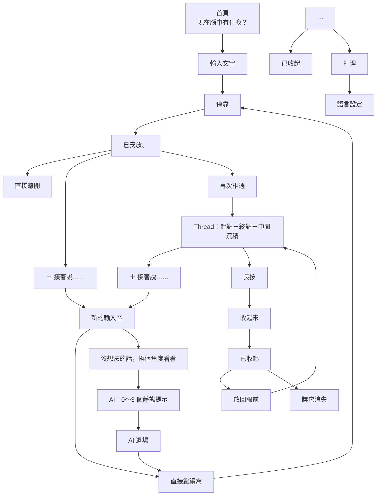

# 思緒停靠 (Mind Harbor) V7.2 — 01～19 正式定案規格

> **「腦中的事，不一定現在就要想清楚。」**

---

# 一、00～19 已定案規格架構

## 00｜Level 0 ⚓ 全螢幕沉降注水定錨（物理／生理出口）
* **定位**：純生理觸覺與感官阻絕出口，解決急性混亂（心跳快、大腦超載、連字都不想面對）的零門檻。
* **交互哲學（避風港注水下錨）**：
  * **按鈕設計**：右上角 44px（`h-11`）標準無障礙觸控藥丸按鈕，內嵌船錨圖示 `<Anchor />` 與進度數值。
* **雙模態交互分流（手勢閾值 260ms）**：
  * **輕點（Tap < 260ms）**：純戳戳發洩模式。清脆微震（`55ms unlatch`）+ 按鈕本體彈性下壓反彈，**完全不觸發全螢幕干擾**，計數即時 +1，專門支援快速連戳發洩。
  * **久按（Hold > 260ms）**：全螢幕注水定錨模式。整面螢幕自底端湧升半透明深邃潮水，將所有文字雜訊物理遮蔽；中央 ⚓ 剪影緩緩下沉，伴隨 20% 節律微震；滿載 100% 觸發重磅 `docking` 機械咬合微震（`[80ms, 40ms, 110ms]`），提示「已定錨 · 風浪平息」，潮水散去重回清明。
  * **中途釋放容錯**：久按中途放開時潮水如重力般平滑退回底部，完全不阻礙正常操作。
* **無文字停靠**：點擊立即浮現淡色統計與轉化錨點 `已定錨 N 次 · 想說的話，再點這裡`。即使完全不輸入任何字，純戳戳／下錨亦屬合法完整的生理停靠紀錄。

## 01｜首頁輸入與四態草稿膠囊（Level 1）
* **核心問題（主標題）**：`把卡在心裡的事，先說出來。`
* **寫作許可（副標題）**：`不用整理，也不用現在就有答案。先從最想說的那一句開始。`
* **首頁不顯示**：歷史內容、Streak、字數、完成率、任務進度、AI Insight、未完成提醒、心情統計。
* **輸入框 Placeholder**：`腦中最先浮出來的那一句……`
* **四態情境草稿膠囊**（一鍵帶入草稿，降低啟動摩擦力，非分類標籤）：
  * **`腦袋太吵`**：`好多念頭同時衝進來，不知道先顧哪一個，停不下來。`
  * **`心裡很悶`**：`剛剛發生了一件事，說不上來是什麼感覺，但心裡很堵。`
  * **`事情卡住`**：`手上有件事卡在兩個選擇之間，完全不知道該怎麼走下一步。`
  * **`先留著`**：`有個念頭我怕之後忘記，想先原封不動留在這裡。`
* **主要按鈕**：`開始說說`（帶入第一段對話）

## 02｜AI 入口
* **首頁不顯示 AI**：首頁不提供 AI，輸入文字時亦不出現。
* **有第一個文字念頭後**：具備使用條件。
* **AI 入口文案**：`沒想法的話，換個角度看看`（可選輔助入口，非必做，非卡住判斷）。

## 03｜收束與心智封裝憑證（Zeigarnik Box）
* **收束哲學**：不是送出按鈕，而是物理感的心智封箱。前額葉已履約完成，合法下班。
* **封裝憑證規格**：
  * **【今日結算】（這次先帶走）**：整理對話中已經說明白的客觀事實（15 到 80 字）。
  * **【明天保管】（留在明天看）**：指認出「今晚即使想破頭也沒有新資訊、必須明天才能驗證」的外部變數（10 到 60 字）；宣示「物理現實明早 09:00 前不收件，今晚在床上運算一律判定為無效」。
  * **接續錨點**：下次若要接著談，可以從具體方向開始，不擴大戰線。
* **實體化咬合**：點擊「封存並回到現在」時觸發深層物理觸覺微震（`[30, 40, 20] docking`），將思緒真正鎖定並寫入本機資料庫。
* **中斷規則**：使用者隨時可選擇「還想再說一點」回到原對話。

## 04｜「＋ 接著說……」
* 代表如果還有話可以繼續，非必經步驟。
* 新內容接續同一 Thread，可再次停靠。
* 平行選項：繼續寫 或「沒想法 $\rightarrow$ 換個角度看看」。

## 05｜AI 使用週期
* **每一個停靠週期，AI 最多使用一次**。
* 最多 4 個提示 $\rightarrow$ AI 退場。
* 不重新生成、不刷新、不換一組、不再次叫出。
* 防止形成無限 AI 對話。

## 06｜Thread｜起點＋終點＋中間沉積
* **三明治結構**：預設只保留「第 1 則：起點」與「最後 1 則：終點」。
* 中間內容沉積以 `···` 表示（不用「+4 則」、「共 6 則」）。
* 主動點開後完整展開所有 Entry。

## 07｜再次相遇
* **入口**：`再次相遇`。
* **段落式時間流（拒絕氣泡方塊）**：嚴禁採用聊天氣泡（Chat Bubble），避免形成即時對話或與機器人聊天的心理暗示；視覺呈現如同一張按時間自然向下生長的安靜活頁紙。
* **三層間距階層 (Spacing Hierarchy)**：
  * **同一 Thread 內部 Entry**：`12px - 16px`（緊湊聚合，末端掛上唯一的 `＋ 接著說……`）。
  * **不同獨立 Thread 之間**：`32px - 40px`（淡灰分隔細線或呼吸留白，清晰區隔不同事件）。
  * **日期分組之間**：`48px - 64px`（大層級換日）。
* **去管理化時間線**：進入後無多餘報表感標題，僅保留平靜返回。
* **去卡片框線**：內容自然浮在畫面上（留白、字級、時間、段落）。
* **日期自然化**：`8 月 30 日`，當天為 `今天`。
* **不提供管理工具**：不主動提供搜尋、分類、篩選、標籤、統計、趨勢分析。
* **最後一則留言容錯修改**：Thread 末端最後一則 Entry 支援點擊「修改」，供修正錯字與即時後悔，保存歷史時序的同時提供必要彈性。

## 08｜「我現在說不上來」
* 完整合法的停靠狀態。
* 點擊：`看見了。` $\rightarrow$ `先放在這裡。`
* 保存底層：`state: ineffable, timestamp, thread_root: true`。
* 「再次相遇」顯示：`說不上來……`，未來仍可 `＋ 接著說……` 接續。

## 09｜「收起來」語言
* 移除舊詞彙：封存、封存區、刪除、還原。
* 正式改用：
  * **收起來**（移出目前視線）
  * **已收起**（已離開主要時間線）
  * **放回眼前**（回到正常時間線）
  * **讓它消失**（確認不再保留於此裝置）
* **已安放 vs 收起來**：已安放為停靠完成；收起來為日後主動移出視線。

## 10｜內容保存與生命週期
* **永遠保留**：已安放內容預設永遠存在。
* 不提供保存期限設定（無 7 天 / 30 天 / 到期設定）。
* **資料位置**：本機保存為原則。
* **唯一正式移除流程**：`已安放` $\rightarrow$ `收起來` $\rightarrow$ `已收起` $\rightarrow$ `讓它消失`。

## 11｜App 關閉／重新開啟
* **零彈窗、零挽留**：未按「停靠」前離開不形成正式 Entry。
* 重新開啟直接回到「現在腦中有什麼？」，不提示還原未完成文字。

## 12｜Thread 成立與延續
* 第一次停靠建立 Root Entry。
* 「＋ 接著說……」永遠接在該 Thread 最後（不允許中間插入）。
* 不因時間（24小時/7天/30天）自動切斷 Thread。

## 13｜Entry 閱讀狀態
* 極簡純淨，內容為主角。
* 核心操作僅保留 `＋ 接著說……`。
* 不常駐顯示功能按鈕。

## 14｜「接著說」中的 AI
1. **進入接著寫**：輸入框下顯示「· 沒想法的話，換個角度看看」與「停靠」。
2. **使用 AI 後**：入口立即消失，無聲出現最多 3 句提示。
3. **停靠後**：AI 提示立即消失，不保存、不進 Thread。
4. **動態視區**：鍵盤喚起時確保提示與游標於舒適視區。

## 15｜AI 伴讀哲學與語義手術刀（外掛前額葉）
* **定位**：冷靜、真誠的客觀「外掛前額葉」，只讀當前句子，拒絕心靈雞湯與傲慢診斷。
* **三步結構**：
  1. **客觀張力**：直接點出原句中客觀存在的兩股拉扯（如：想快點做好 vs 現實需要時間；身體疲憊 vs 大腦預演）。嚴禁複誦原句超過 6 個字，嚴禁安慰。
  2. **物理邊界**：用大白話切開「已經發生的客觀事實」與「尚未發生的腦內預演」，只談客觀物理事實與變數，嚴禁使用任何心理學術語。
  3. **降維支點**：留下一個極度具體、只要回答「是/否」或「挑一個」的收斂性問題，不替使用者下結論。
* **嚴格禁止紅線**：
  * **禁安慰套話**：辛苦了、這很正常、允許自己、放鬆、深呼吸、這不容易。
  * **禁心理標籤**：心理、壓力、焦慮、恐懼、逃避、人格、自我恐嚇、防衛、潛意識。
  * **禁傲慢診斷**：你其實、你在、這顯示、真正原因、你只是。
  * **禁文學修辭**：比喻（如法庭、審判、黑夜、鐘聲等）、散文演繹、舞台劇描繪。
* **單一透鏡視角**：換角度時採單鏡頭輪播（4 個不同觀點與延續問題），不一次攤開四張造成認知負擔。
* **Safety Gate**：高風險內容由獨立 Safety UX 接住，不套用提示生成。

## 16｜AI 上下文讀取範圍（雙層隔離原則）
* **跨 Session / 歷史 Thread 絕對隔離**：
  * AI 絕不讀取跨天、跨事件的過往 Entry、歷史 Thread 或使用者畫像。
  * 歷史是使用者的客觀沉積，非 AI 的全知資料庫；嚴禁 AI 做跨期心理分析或長期行為追蹤。
* **當次 Session 內部上下文注入（In-Session Context）**：
  * 當使用者在同一場停靠中「＋ 接著說……」續寫時，AI **必須讀取當次 Session 內的前文對話**，以正確理解代名詞（例如「她/他/這件事」指涉何人何事）與場景脈絡，防止失憶脫節與自說自話。
  * **焦點依然在最新一句**：前文僅作為語義錨點，AI 回覆的語義手術刀重心依然聚焦在當前最新發出的句子。

## 17｜「收起來」入口
* 主畫面不常駐收起來按鈕。
* 右上角提供低存在感 `···` 隱形抽屜：內含 `已收起` 與 `打理`。
* Entry 操作透過「長按」呼叫。

## 18｜已收起空間
* 獨立安靜空間，頂部 `← 回去` / `已收起`。
* 每則 Entry 直接提供「放回眼前」與「讓它消失」兩個低對比 Ghost Button（1px 淡框、透明底、圓角 6px、大觸控熱區）。
* 在已收起內容點擊「＋ 接著說……」產生之新 Entry 會**回到正常時間線**。

## 19｜「打理」
* 目前僅提供語言設定（預設 `繁體中文`）。
* 不堆放其他設定與開關。

---

# 二、整體心智流向

---

# 三、核心精神總結

> **連字都不想打時，可以只按右上角消波。**
> **可以寫。**
> **可以停靠。**
> **可以什麼都不做。**
> **可以接著說。**
> **沒想法時，讓 AI 作為客觀外掛前額葉幫你切開事實與預演。**
> **物理現實明早 09:00 前不收件，今晚在床上運算一律判定為無效。**
> **內容可以一直留著。**
> **不想看了，可以收起來。**
> **真的不要了，才讓它消失。**
> **即使說不上來、只按了消波，也算一次完整的停靠。**
> 
> **腦中的事，不一定現在就要想清楚。**

