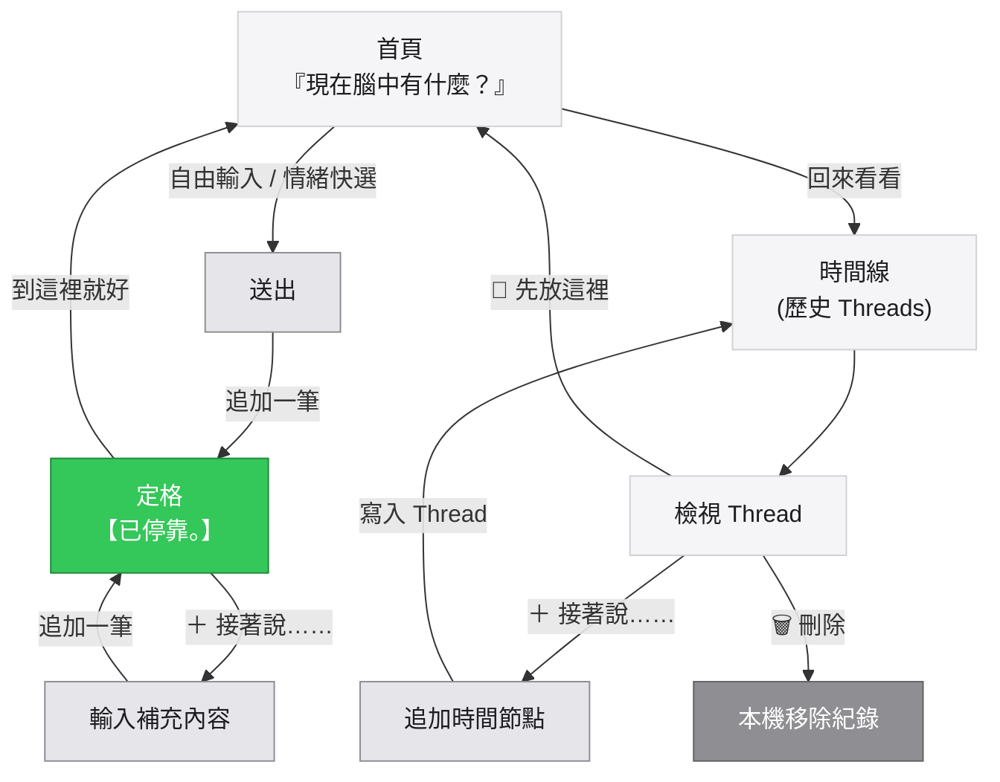

# 思緒停靠 v6 完整流程圖

### 一、文字流程架構

```text
【思緒停靠 v6】
                               │
                               ▼
                  ┌─────────────────────┐
                  │ 現在腦中有什麼？    │
                  └─────────────────────┘
                               │
                 ┌─────────────┴─────────────┐
                 │                           │
              自由輸入                    情緒快選
                 │                           │
                 └─────────────┬─────────────┘
                               ▼
                             送出
                               │
                               ▼
                         【已停靠。】
                               │
                 ┌─────────────┴─────────────┐
                 │                           │
             到這裡就好                  ＋ 接著說……
                 │                           │
                 ▼                           ▼
             安靜離開                    追加一筆
                                             │
                                             ▼
                                          【已停靠。】


---

回來以後

首頁
 │
 └── 回來看看
          │
          ▼
      時間線
          │
          ▼
       Thread
          │
          ├── 8/27
          │    爸媽年紀越來越大了。
          │
          ├── 8/29
          │    好像真的應該多陪他們吃飯。
          │
          └── 9/03
               昨天陪爸媽吃飯，突然覺得
               其實我只是害怕有一天來不及。
          │
          ▼
 ┌────────────┬──────────────┐
 │            │              │
 ▼            ▼              ▼
＋接著說    🍃先放這裡     🗑刪除
 │            │              │
 ▼            ▼              ▼
追加        離開畫面       刪除紀錄
```

---

### 二、Mermaid 狀態與動作流


