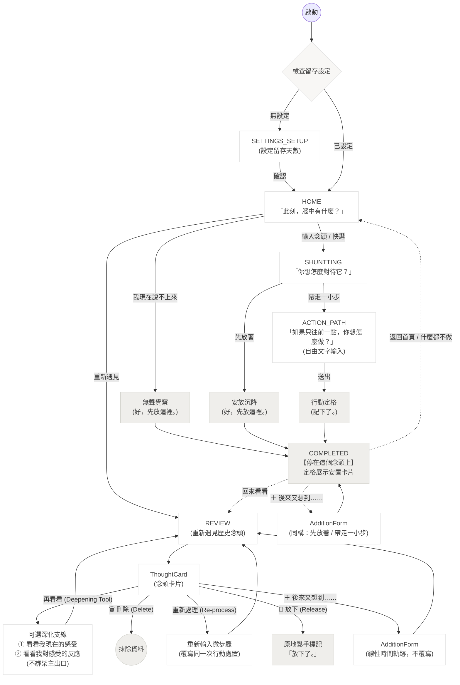

```mermaid
flowchart TD
    %% 進入點
    Start(("啟動")) --> InitCheck{"檢查留存設定"}
    InitCheck -- "無設定" --> SETUP["SETTINGS_SETUP\n(設定留存天數)"]
    SETUP -- "確認" --> HOME
    InitCheck -- "已設定" --> HOME["HOME\n「此刻，腦中有什麼？」"]

    %% HOME 選擇
    HOME -- "輸入念頭 / 快選" --> SHUNTTING["SHUNTTING\n「你想怎麼對待它？」"]
    HOME -- "我現在說不上來" --> AWARENESS["無聲覺察\n(好，先放這裡。)"]
    HOME -- "重新遇見" --> REVIEW["REVIEW\n(重新遇見歷史念頭)"]

    %% SHUNTTING 只有二選一
    SHUNTTING -- "先放著" --> DEPOSIT_END["安放沉降\n(好，先放這裡。)"]
    SHUNTTING -- "帶走一小步" --> ACTION_PATH["ACTION_PATH\n「如果只往前一點，你想怎麼做？」\n(自由文字輸入)"]
    ACTION_PATH -- "送出" --> ACTION_END["行動定格\n(記下了。)"]

    %% 儀式與定格停靠
    AWARENESS --> COMPLETED["COMPLETED\n【停在這個念頭上】\n定格展示安置卡片"]
    DEPOSIT_END --> COMPLETED
    ACTION_END --> COMPLETED

    %% 停靠後出口
    COMPLETED -. "＋ 後來又想到……" .-> ADDITION["AdditionForm\n(同構：先放著 / 帶走一小步)"]
    ADDITION --> COMPLETED
    COMPLETED -. "回來看看" .-> REVIEW
    COMPLETED -. "返回首頁 / 什麼都不做" .-> HOME

    %% 重新遇見 (REVIEW) 與卡片互動模組
    REVIEW --> TCARD["ThoughtCard\n(念頭卡片)"]
    
    %% 卡片四大支線操作
    TCARD -- "＋ 後來又想到……" --> ADDITION_REVIEW["AdditionForm\n(線性時間軌跡，不覆寫)"]
    ADDITION_REVIEW --> REVIEW
    
    TCARD -- "重新處理 (Re-process)" --> REPROCESS["重新輸入微步驟\n(覆寫同一次行動處置)"]
    REPROCESS --> REVIEW
    
    TCARD -- "再看看 (Deepening Tool)" --> DEEPEN["可選深化支線\n① 看看我現在的感受\n② 看看我對感受的反應\n(不綁架主出口)"]
    DEEPEN --> REVIEW

    TCARD -- "🍃 放下 (Release)" --> RELEASE_STATE["原地鬆手標記\n「放下了。」"]
    TCARD -- "🗑️ 刪除 (Delete)" --> DELETE_STATE(("抹除資料"))

    %% 樣式定義
    classDef state fill:#FFFFFF,stroke:#E0E0E0,stroke-width:1px,color:#424242;
    classDef decision fill:#F8F7F5,stroke:#E0E0E0,stroke-width:1px,color:#424242,shape:hexagon;
    classDef ending fill:#EFEEEB,stroke:#D1D1CB,stroke-width:1px,color:#424242;
    
    class HOME,SHUNTTING,ACTION_PATH,REVIEW,SETUP,ADDITION,ADDITION_REVIEW,TCARD,REPROCESS,DEEPEN state;
    class InitCheck decision;
    class COMPLETED,DEPOSIT_END,ACTION_END,AWARENESS,RELEASE_STATE,DELETE_STATE ending;
```
