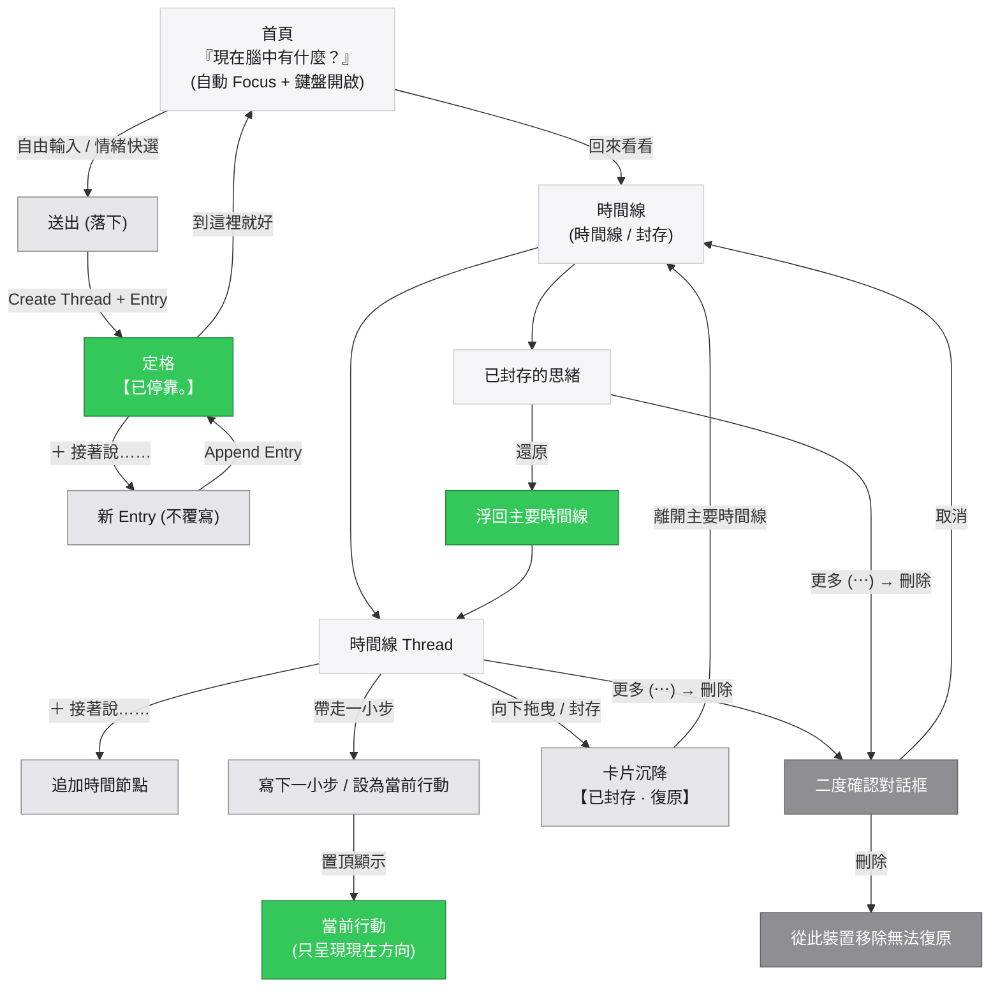

# 思緒停靠 V7 完整流程架構

### 一、整體 UI 心智模型

```text
                         思緒停靠
                             │
                             ▼
                  「現在腦中有什麼？」
                             │
                             ▼
                          寫下來
                             │
                             ▼
                       「已停靠。」
                             │
                  ┌──────────┴──────────┐
                  ▼                     ▼
             到這裡就好             ＋ 接著說……
                  │                     │
                  ▼                     ▼
                 首頁                新 Entry
                                        │
                                        ▼
                                    時間線累積
                                        │
                                        ├──── ＋ 接著說……
                                        │
                                        ├──── 帶走一小步
                                        │          │
                                        │          ▼
                                        │       當前行動
                                        │
                                        └──── 向下拖曳
                                                   │
                                                   ▼
                                                 封存
                                                   │
                                                   ▼
                                                封存區
                                                   │
                                                   ▼
                                                 還原
                                                   │
                                                   ▼
                                                 時間線


                    刪除
                      │
                      ▼
                  二度確認
                      │
                      ▼
                  永久抹除
```

---

### 二、Mermaid 狀態與動作流


