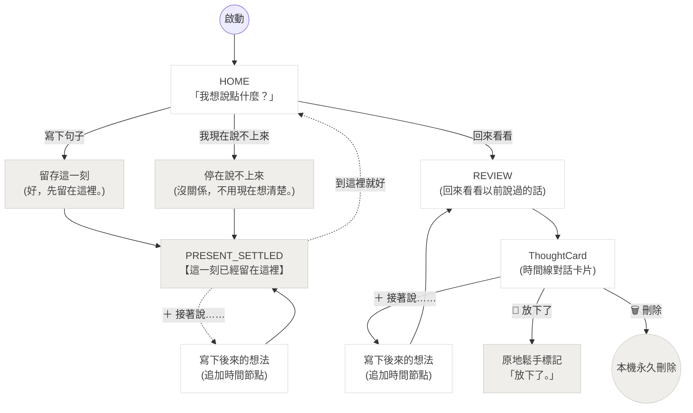

```mermaid
flowchart TD
    %% 進入點
    Start(("啟動")) --> HOME["HOME\n「我想說點什麼？」"]

    %% HOME 選擇
    HOME -- "寫下句子" --> SAVE["留存這一刻\n(好，先留在這裡。)"]
    HOME -- "我現在說不上來" --> SAVE_UNPOKEN["停在說不上來\n(沒關係，不用現在想清楚。)"]
    HOME -- "回來看看" --> REVIEW["REVIEW\n(回來看看以前說過的話)"]

    %% 留存定格態
    SAVE --> PRESENT["PRESENT_SETTLED\n【這一刻已經留在這裡】"]
    SAVE_UNPOKEN --> PRESENT

    %% 留存後出口
    PRESENT -. "到這裡就好" .-> HOME
    PRESENT -. "＋ 接著說……" .-> APPEND_PRESENT["寫下後來的想法\n(追加時間節點)"]
    APPEND_PRESENT --> PRESENT

    %% 回來看看 (REVIEW) 與卡片互動模組
    REVIEW --> TCARD["ThoughtCard\n(時間線對話卡片)"]
    
    %% 卡片支線操作
    TCARD -- "＋ 接著說……" --> APPEND_REVIEW["寫下後來的想法\n(追加時間節點)"]
    APPEND_REVIEW --> REVIEW

    TCARD -- "🍃 放下了" --> RELEASE_STATE["原地鬆手標記\n「放下了。」"]
    TCARD -- "🗑️ 刪除" --> DELETE_STATE(("本機永久刪除"))

    %% 樣式定義
    classDef state fill:#FFFFFF,stroke:#E0E0E0,stroke-width:1px,color:#424242;
    classDef ending fill:#EFEEEB,stroke:#D1D1CB,stroke-width:1px,color:#424242;
    
    class HOME,REVIEW,APPEND_PRESENT,APPEND_REVIEW,TCARD state;
    class PRESENT,SAVE,SAVE_UNPOKEN,RELEASE_STATE,DELETE_STATE ending;
```
