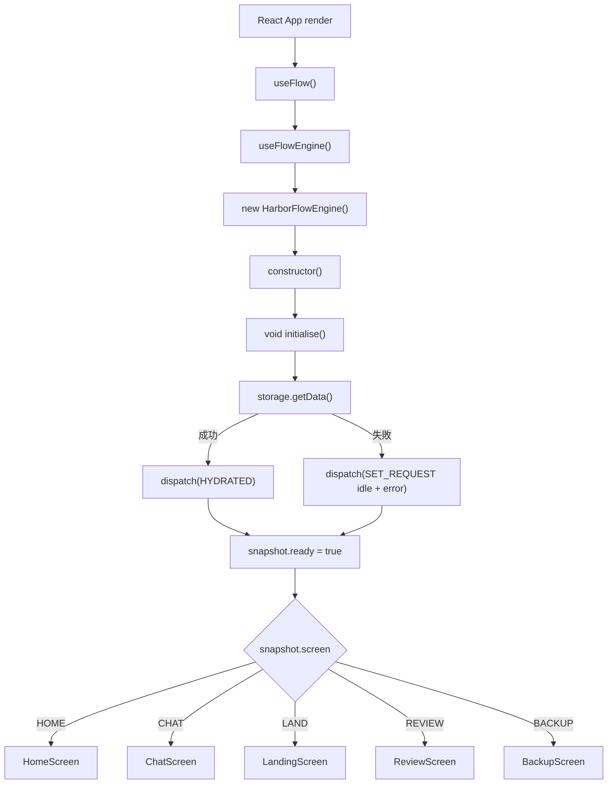
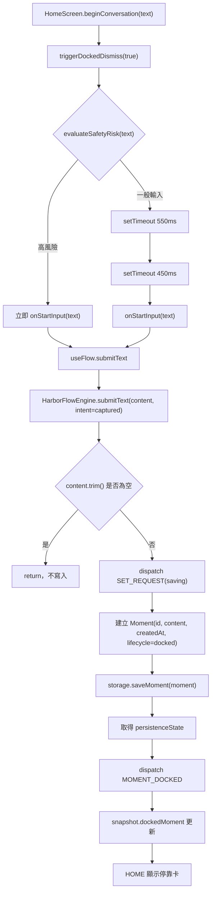
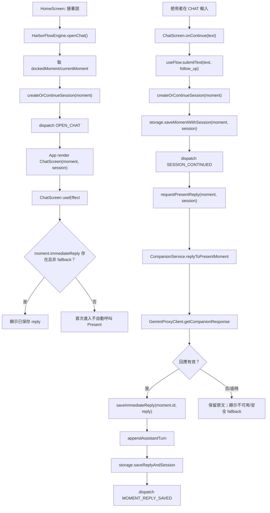
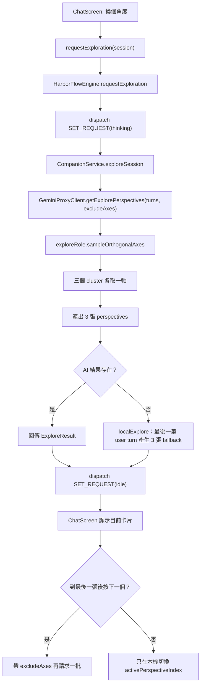
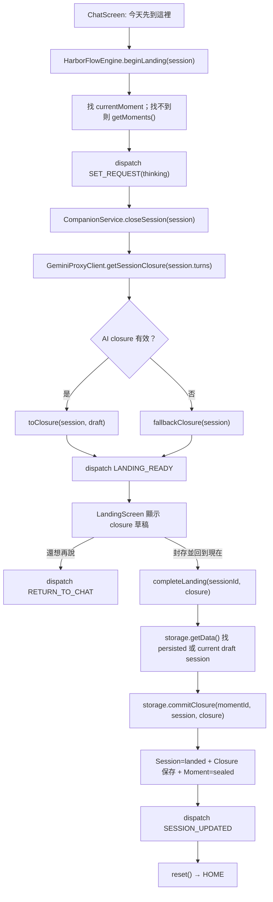
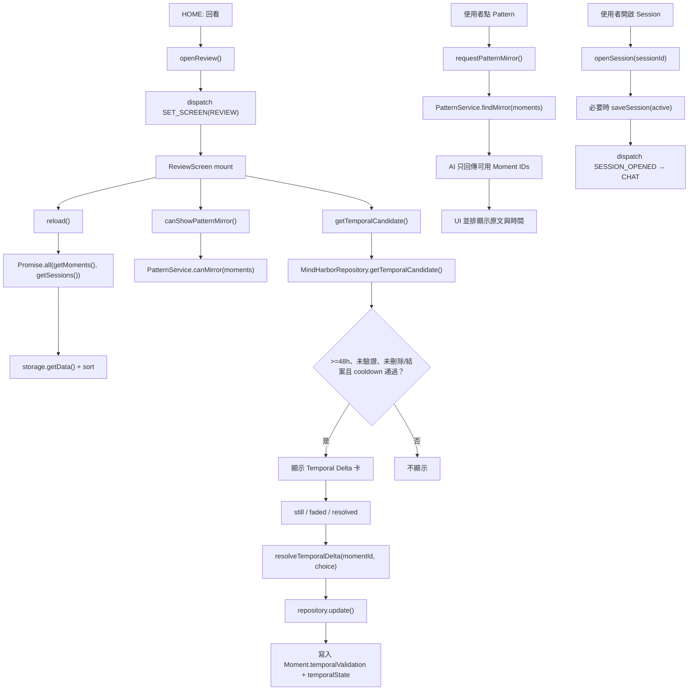
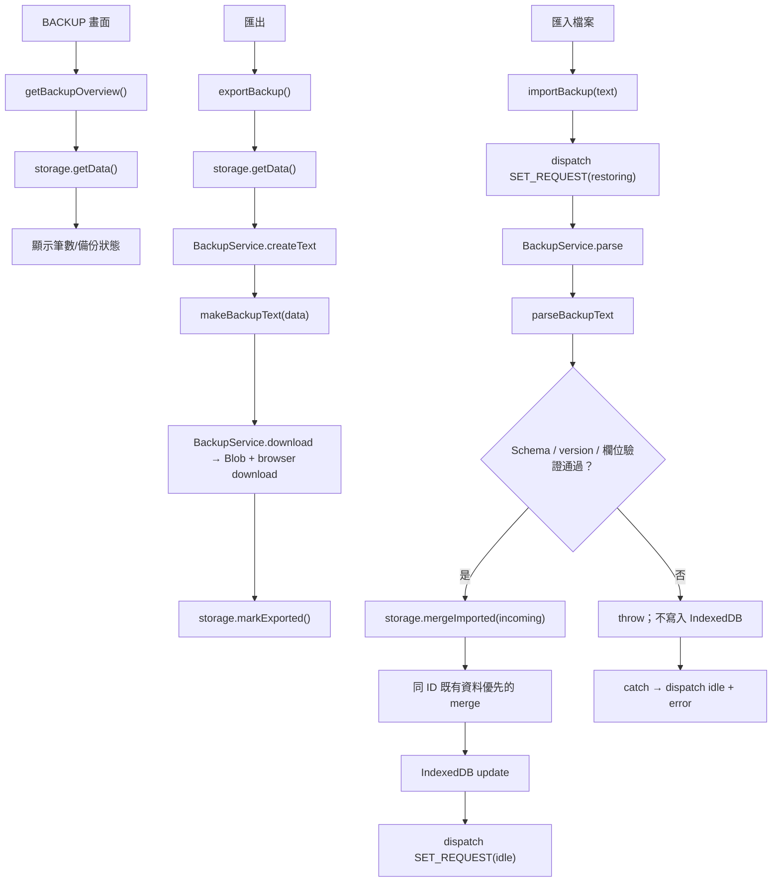
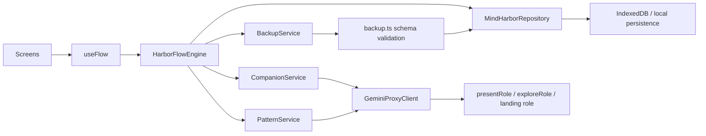

# 程式實際流程圖（source-level）

> 本圖依目前 source code 的實際呼叫鏈繪製。節點中的檔案與函式名稱可直接回到程式搜尋。核心原則：畫面只發出事件；HarborFlowEngine 協調狀態、資料與 AI；MindHarborRepository 負責 IndexedDB 寫入。

## 1. App 啟動與畫面分派

App.tsx 只依 flow.state 選畫面，所有畫面 callback 都來自 useFlow.ts。

## 2. HOME 實際輸入流程

停靠卡分支：接著說 → openChat()；封裝存檔 → beginLandingFromMoment()；結束停靠 → dismissDockedMoment()（只清顯示，不刪 Moment）。

右上角定錨：recordAnchorEvent(tap 或 hold, durationMs) → MindHarborRepository.recordAnchorEvent() 寫入 AnchorEvent。

## 3. CHAT 實際流程

Present 的去重與取消：requestPresentReply() 使用 presentReplyRequests 去重；新的請求先 abort 舊請求；visibilitychange 進入背景也取消中的請求。

## 4. CHAT Explore 實際流程

Explore 不寫入 Moment、Session 或 Closure；採用卡片只把 followUp 帶進輸入框。

## 5. LAND 實際流程

## 6. REVIEW 實際流程

PatternService.canMirror() 先做確定性門檻；AI 只負責選原文 ID，Review UI 不顯示文字推論。

## 7. BACKUP 實際流程

## 8. 實際資料流總結

目前最容易被誤讀的實際差異：

1. openChat() 本身不呼叫 Present；CHAT 首次顯示依賴 Moment 已有 immediateReply。
2. Explore Router 已不存在；正常 AI 路徑與 fallback 都是三張卡、三個正交軸。
