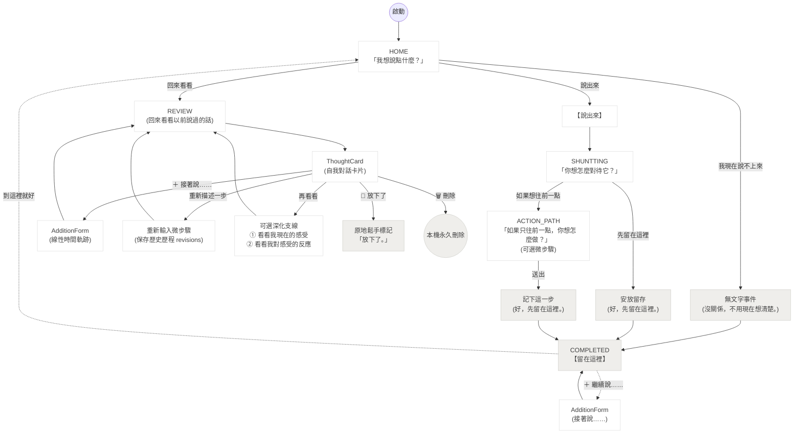

```mermaid
flowchart TD
    %% 進入點
    Start(("啟動")) --> HOME["HOME\n「我想說點什麼？」"]

    %% HOME 選擇
    HOME -- "說出來" --> RECEIVE["【說出來】"]
    HOME -- "我現在說不上來" --> UNPOKEN["無文字事件\n(沒關係，不用現在想清楚。)"]
    HOME -- "回來看看" --> REVIEW["REVIEW\n(回來看看以前說過的話)"]

    RECEIVE --> SHUNTTING["SHUNTTING\n「你想怎麼對待它？」"]

    %% SHUNTTING
    SHUNTTING -- "先留在這裡" --> DEPOSIT_END["安放留存\n(好，先留在這裡。)"]
    SHUNTTING -- "如果想往前一點" --> ACTION_PATH["ACTION_PATH\n「如果只往前一點，你想怎麼做？」\n(可選微步驟)"]
    ACTION_PATH -- "送出" --> ACTION_END["記下這一步\n(好，先留在這裡。)"]

    %% 留存完成態
    UNPOKEN --> COMPLETED["COMPLETED\n【留在這裡】"]
    DEPOSIT_END --> COMPLETED
    ACTION_END --> COMPLETED

    %% 留存後出口
    COMPLETED -. "到這裡就好" .-> HOME
    COMPLETED -. "＋ 繼續說……" .-> ADDITION_COMPLETED["AdditionForm\n(接著說……)"]
    ADDITION_COMPLETED --> COMPLETED

    %% 回來看看 (REVIEW) 與卡片互動模組
    REVIEW --> TCARD["ThoughtCard\n(自我對話卡片)"]
    
    %% 卡片支線操作
    TCARD -- "＋ 接著說……" --> ADDITION_REVIEW["AdditionForm\n(線性時間軌跡)"]
    ADDITION_REVIEW --> REVIEW
    
    TCARD -- "重新描述一步" --> REPROCESS["重新輸入微步驟\n(保存歷史歷程 revisions)"]
    REPROCESS --> REVIEW
    
    TCARD -- "再看看" --> DEEPEN["可選深化支線\n① 看看我現在的感受\n② 看看我對感受的反應"]
    DEEPEN --> REVIEW

    TCARD -- "🍃 放下了" --> RELEASE_STATE["原地鬆手標記\n「放下了。」"]
    TCARD -- "🗑️ 刪除" --> DELETE_STATE(("本機永久刪除"))

    %% 樣式定義
    classDef state fill:#FFFFFF,stroke:#E0E0E0,stroke-width:1px,color:#424242;
    classDef ending fill:#EFEEEB,stroke:#D1D1CB,stroke-width:1px,color:#424242;
    
    class HOME,RECEIVE,SHUNTTING,ACTION_PATH,REVIEW,ADDITION_COMPLETED,ADDITION_REVIEW,TCARD,REPROCESS,DEEPEN state;
    class COMPLETED,DEPOSIT_END,ACTION_END,UNPOKEN,RELEASE_STATE,DELETE_STATE ending;
```
