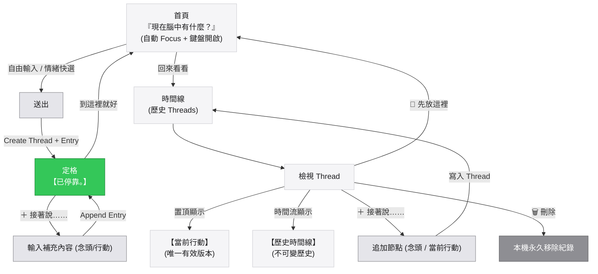

# 思緒停靠 V7 完整流程圖

### 一、文字流程架構

```text
【思緒停靠 V7】
                               │
                               ▼
                 ┌───────────────────────────┐
                 │ 自動 Focus 輸入框 / 喚起鍵盤 │
                 ├───────────────────────────┤
                 │    「現在腦中有什麼？」    │
                 └─────────────┬─────────────┘
                               │
                ┌──────────────┴──────────────┐
                │                             │
             自由輸入                      情緒快選
        （念頭 / 感受 / 行動）          生氣/委屈/焦慮/難過...
                │                             │
                └──────────────┬──────────────┘
                               ▼
                             [送出]
                               │
                               ▼
                     Create Thread + Entry
                               │
                               ▼
                         【已停靠。】
                               │
                 ┌─────────────┴─────────────┐
                 │                           │
             到這裡就好                  ＋ 接著說……
                 │                           │
                 ▼                           ▼
             安靜離開                    追加一筆 (念頭/行動)
                                             │
                                             ▼
                                         【已停靠。】


---

回來以後（瀏覽流）

首頁
 │
 └──► 回來看看
          │
          ▼
       時間線
          │
          ▼
      選擇 Thread
          │
          ▼
 ┌──────────────────────────────────────┐
 │                                      │
 │   【當前行動】                        │
 │   唯一有效版本（若有行動意圖）        │
 │                                      │
 └──────────────────────────────────────┘
          │
          ▼
 ──────── 歷史時間線 ────────
          │
          ├── 8/27 念頭：爸媽年紀越來越大了。
          ├── 8/28 行動：明天問朋友有沒有推薦搬家公司。
          └── 8/29 行動：算了，先等等。
          │
          ▼
 ┌────────────┬──────────────┬───────────┐
 │            │              │           │
 ▼            ▼              ▼           ▼
＋接著說    設為當前行動   🍃先放這裡  🗑刪除
 │            │              │           │
 ▼            ▼              ▼           ▼
追加        更新置頂       離開畫面    移除紀錄
```

---

### 二、Mermaid 狀態與動作流


