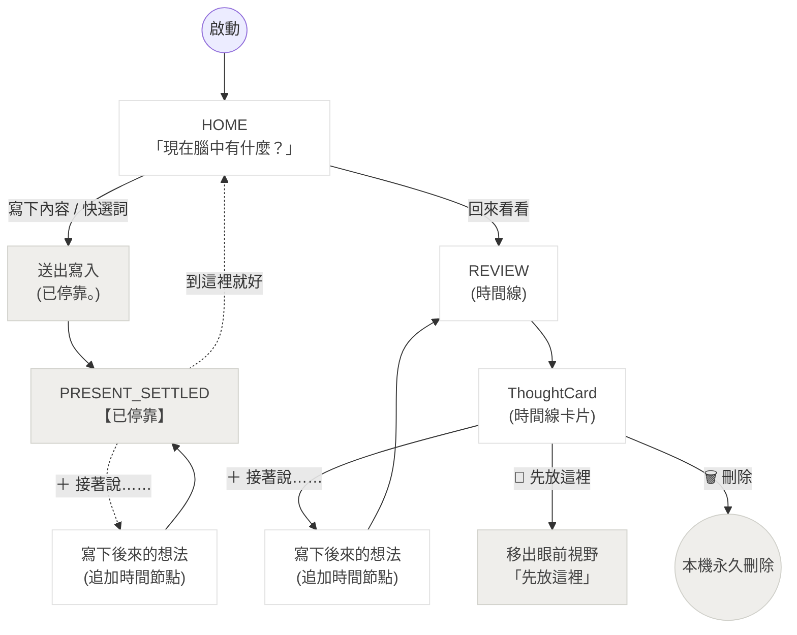

```mermaid
flowchart TD
    %% 進入點
    Start(("啟動")) --> HOME["HOME\n「現在腦中有什麼？」"]

    %% HOME 選擇
    HOME -- "寫下內容 / 快選詞" --> SAVE["送出寫入\n(已停靠。)"]
    HOME -- "回來看看" --> REVIEW["REVIEW\n(時間線)"]

    %% 留存定格態
    SAVE --> PRESENT["PRESENT_SETTLED\n【已停靠】"]

    %% 留存後出口
    PRESENT -. "到這裡就好" .-> HOME
    PRESENT -. "＋ 接著說……" .-> APPEND_PRESENT["寫下後來的想法\n(追加時間節點)"]
    APPEND_PRESENT --> PRESENT

    %% 時間線 (REVIEW) 與卡片互動模組
    REVIEW --> TCARD["ThoughtCard\n(時間線卡片)"]
    
    %% 卡片 3 個物理操作
    TCARD -- "＋ 接著說……" --> APPEND_REVIEW["寫下後來的想法\n(追加時間節點)"]
    APPEND_REVIEW --> REVIEW

    TCARD -- "🍃 先放這裡" --> RELEASE_STATE["移出眼前視野\n「先放這裡」"]
    TCARD -- "🗑️ 刪除" --> DELETE_STATE(("本機永久刪除"))

    %% 樣式定義
    classDef state fill:#FFFFFF,stroke:#E0E0E0,stroke-width:1px,color:#424242;
    classDef ending fill:#EFEEEB,stroke:#D1D1CB,stroke-width:1px,color:#424242;
    
    class HOME,REVIEW,APPEND_PRESENT,APPEND_REVIEW,TCARD state;
    class PRESENT,SAVE,RELEASE_STATE,DELETE_STATE ending;
```
