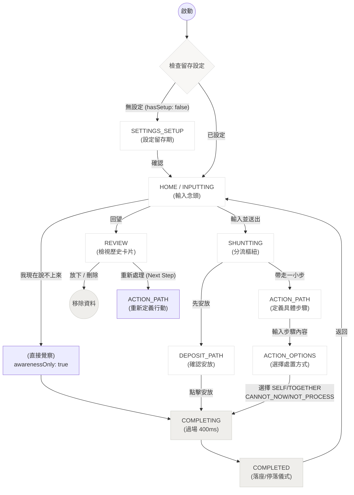

```mermaid
flowchart TD
    %% 進入點
    Start(("啟動")) --> InitCheck{"檢查留存設定"}
    InitCheck -- "無設定 (hasSetup: false)" --> SETUP["SETTINGS_SETUP\n(設定留存期)"]
    SETUP -- "確認" --> HOME
    InitCheck -- "已設定" --> HOME["HOME / INPUTTING\n(輸入念頭)"]

    %% HOME 選擇
    HOME -- "輸入並送出" --> SHUNTTING["SHUNTTING\n(分流樞紐)"]
    HOME -- "我現在說不上來" --> AWARENESS["(直接覺察)\nawarenessOnly: true"]
    HOME -- "回望" --> REVIEW["REVIEW\n(檢視歷史卡片)"]

    %% 覺察直接結束
    AWARENESS --> COMPLETING

    %% SHUNTTING 分支
    SHUNTTING -- "先安放" --> DEPOSIT_PATH["DEPOSIT_PATH\n(確認安放)"]
    SHUNTTING -- "帶走一小步" --> ACTION_PATH["ACTION_PATH\n(定義具體步驟)"]

    %% DEPOSIT 分支
    DEPOSIT_PATH -- "點擊安放" --> COMPLETING

    %% ACTION 分支
    ACTION_PATH -- "輸入步驟內容" --> ACTION_OPTIONS["ACTION_OPTIONS\n(選擇處置方式)"]
    ACTION_OPTIONS -- "選擇 SELF/TOGETHER\nCANNOT_NOW/NOT_PROCESS" --> COMPLETING

    %% 儀式與完成
    COMPLETING["COMPLETING\n(過場 400ms)"] --> COMPLETED["COMPLETED\n(落座/停落儀式)"]
    COMPLETED -- "返回" --> HOME

    %% 回望與重新處理
    REVIEW -- "放下 / 刪除" --> Delete(("移除資料"))
    REVIEW -- "重新處理 (Next Step)" --> ACTION_PATH_REENTRY["ACTION_PATH\n(重新定義行動)"]
    
    %% Style tweaks
    classDef state fill:#FFFFFF,stroke:#E0E0E0,stroke-width:1px,color:#424242;
    classDef decision fill:#F8F7F5,stroke:#E0E0E0,stroke-width:1px,color:#424242,shape:hexagon;
    classDef ending fill:#EFEEEB,stroke:#D1D1CB,stroke-width:1px,color:#424242;
    
    class HOME,SHUNTTING,DEPOSIT_PATH,ACTION_PATH,ACTION_OPTIONS,REVIEW,SETUP state;
    class InitCheck decision;
    class COMPLETING,COMPLETED,Delete ending;
```
