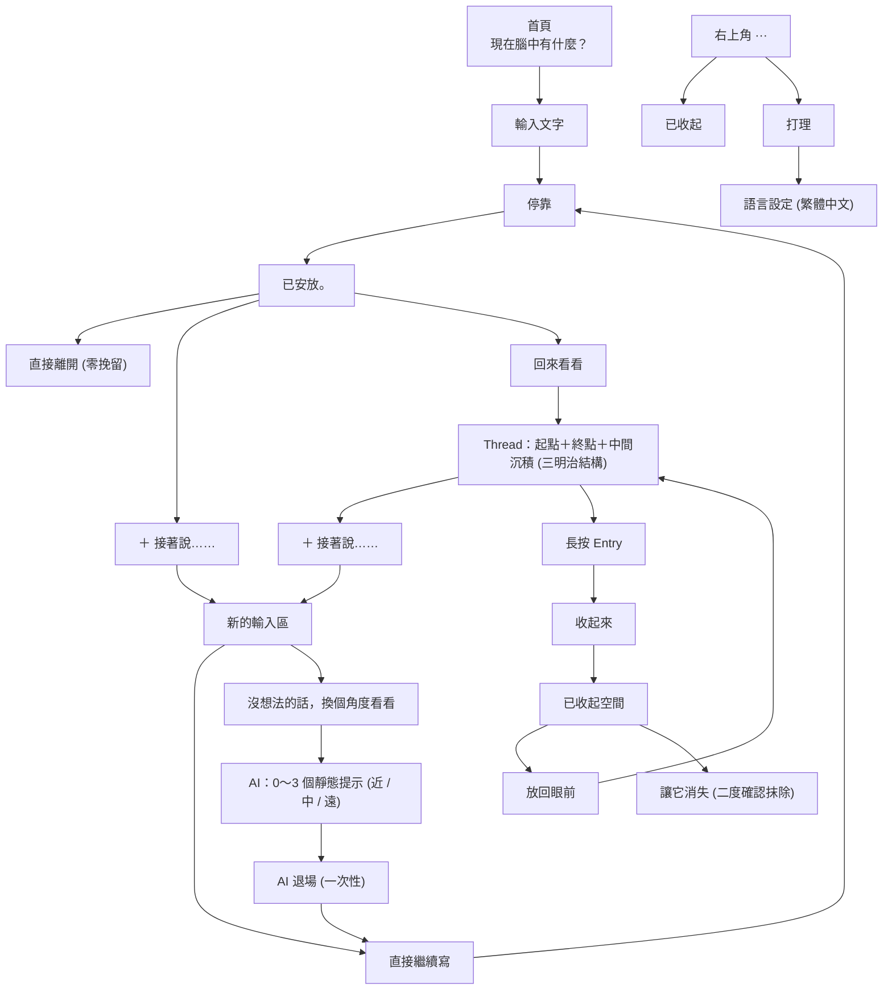

# 思緒停靠（Mind Harbor）V7.2 完整流程架構

### 一、01～19 核心流程圖



---

### 二、01～19 狀態與心智流向說明

```text
【首頁輸入】
「現在腦中有什麼？」
  ├─ 四個快速輸入（今天有點累 / 有件事讓我在意 / 今天有件事很開心 / 突然想到一件事）
  ├─ 我現在說不上來 → 「看見了。」→ 「先放在這裡。」（state: ineffable）
  └─ 停靠 → 文字輕微下沉 → 「已安放。」

【停靠完成】
「已安放。」
  ├─ 直接離開（零挽留、零彈窗）
  └─ ＋ 接著說…… → 進入書寫狀態
        ├─ 繼續寫 → 再次停靠（同一 Thread 末端）
        └─ 沒想法的話，換個角度看看 → 0～3 句近/中/遠起手式 → AI 退場

【回來看看】
無頁面標題，去卡片框線，自然日期（8 月 30 日 / 今天）
  ├─ Thread 三明治結構（起點 + 終點 + 中間沉積 ···）
  ├─ 點開 Thread → 完整展開
  └─ 長按 Entry → 「收起來」

【已收起空間】
右上角 ··· → 已收起
  ├─ 長按內容 → 「放回眼前」（回正常時間線）
  ├─ 長按內容 → 「讓它消失」（永久刪除）
  └─ ＋ 接著說…… → 新內容回到正常時間線

【打理】
右上角 ··· → 打理
  └─ 語言切換（繁體中文）
```
