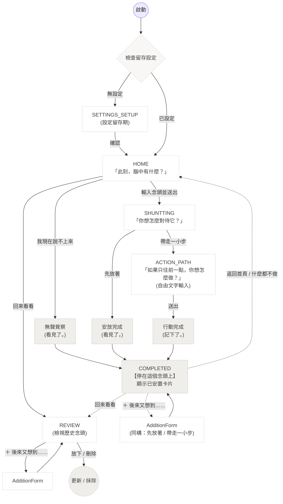

```mermaid
flowchart TD
    %% 進入點
    Start(("啟動")) --> InitCheck{"檢查留存設定"}
    InitCheck -- "無設定" --> SETUP["SETTINGS_SETUP\n(設定留存期)"]
    SETUP -- "確認" --> HOME
    InitCheck -- "已設定" --> HOME["HOME\n「此刻，腦中有什麼？」"]

    %% HOME 選擇
    HOME -- "輸入念頭並送出" --> SHUNTTING["SHUNTTING\n「你想怎麼對待它？」"]
    HOME -- "我現在說不上來" --> AWARENESS["無聲覺察\n(看見了。)"]
    HOME -- "回來看看" --> REVIEW["REVIEW\n(檢視歷史念頭)"]

    %% SHUNTTING 只有二選一
    SHUNTTING -- "先放著" --> DEPOSIT_END["安放完成\n(看見了。)"]
    SHUNTTING -- "帶走一小步" --> ACTION_PATH["ACTION_PATH\n「如果只往前一點，你想怎麼做？」\n(自由文字輸入)"]
    ACTION_PATH -- "送出" --> ACTION_END["行動完成\n(記下了。)"]

    %% 儀式與定格停靠
    AWARENESS --> COMPLETED["COMPLETED\n【停在這個念頭上】\n顯示已安置卡片"]
    DEPOSIT_END --> COMPLETED
    ACTION_END --> COMPLETED

    %% 停靠後的三個安靜出口
    COMPLETED -. "＋ 後來又想到……" .-> ADDITION["AdditionForm\n(同構：先放著 / 帶走一小步)"]
    ADDITION --> COMPLETED
    COMPLETED -. "回來看看" .-> REVIEW
    COMPLETED -. "返回首頁 / 什麼都不做" .-> HOME

    %% 回望
    REVIEW -- "＋ 後來又想到……" --> ADDITION_REVIEW["AdditionForm"]
    ADDITION_REVIEW --> REVIEW
    REVIEW -- "放下 / 刪除" --> REVIEW_MANAGE(("更新 / 抹除"))
    
    %% Style tweaks
    classDef state fill:#FFFFFF,stroke:#E0E0E0,stroke-width:1px,color:#424242;
    classDef decision fill:#F8F7F5,stroke:#E0E0E0,stroke-width:1px,color:#424242,shape:hexagon;
    classDef ending fill:#EFEEEB,stroke:#D1D1CB,stroke-width:1px,color:#424242;
    
    class HOME,SHUNTTING,ACTION_PATH,REVIEW,SETUP,ADDITION,ADDITION_REVIEW state;
    class InitCheck decision;
    class COMPLETED,DEPOSIT_END,ACTION_END,AWARENESS,REVIEW_MANAGE ending;
```
