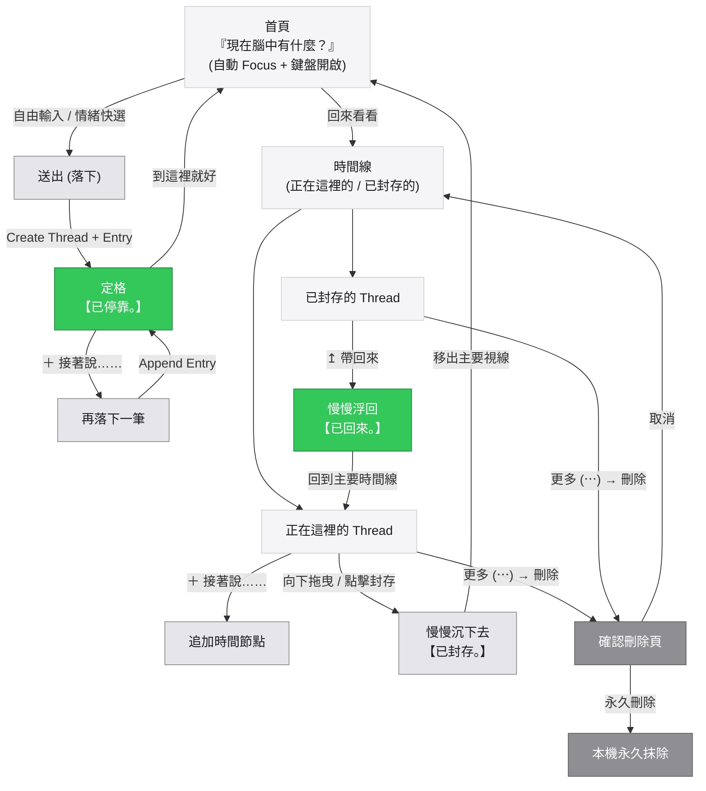

# 思緒停靠 V7.1 完整流程圖

### 一、文字流程架構

```text
【思緒停靠 V7.1】
                               │
                               ▼
                 ┌───────────────────────────┐
                 │ 自動 Focus 輸入框 / 喚起鍵盤 │
                 ├───────────────────────────┤
                 │    「現在腦中有什麼？」    │
                 └─────────────┬─────────────┘
                               │
                ┌──────────────┴──────────────┐
                │                             │
             自由輸入                      情緒快選
        （念頭 / 感受 / 行動）          生氣/委屈/焦慮/難過...
                │                             │
                └──────────────┬──────────────┘
                               ▼
                             [送出]
                               │
                               ▼
                     文字離開輸入框 → 輕輕落下
                               │
                               ▼
                         【已停靠。】
                               │
                 ┌─────────────┴─────────────┐
                 │                           │
             到這裡就好                  ＋ 接著說……
                 │                           │
                 ▼                           ▼
             安靜離開                    再落下一筆
                                             │
                                             ▼
                                         【已停靠。】


---

回來以後（瀏覽與儀式流）

首頁
 │
 └──► 回來看看
          │
          ▼
       時間線
    ┌─────┴───────────────────┐
    │                         │
    ▼                         ▼
【正在這裡的】             【已封存的】
    │                         │
    ├── ＋ 接著說             ├── ↥ 帶回來（慢慢浮回）
    │                         │
    ├── 🍃 封存（慢慢沉下去）  └── 更多 (⋯) → 刪除
    │
    └── 更多 (⋯) → 刪除
              │
              ▼
         確認刪除頁
         ┌────┴────┐
         │         │
        取消     永久刪除
```

---

### 二、Mermaid 狀態與動作流


