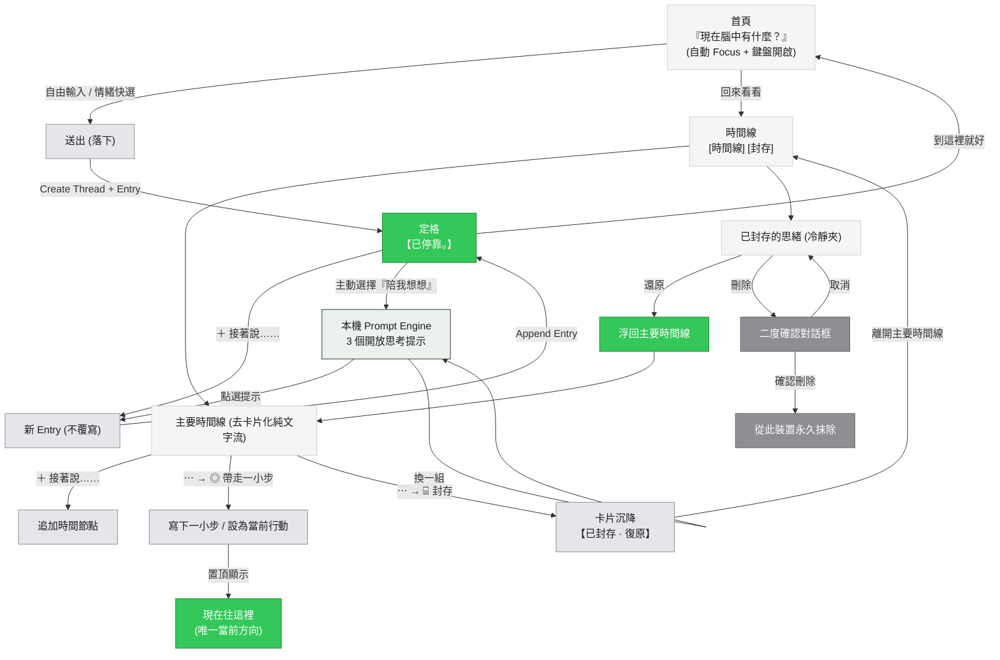

# 思緒停靠（Mind Harbor）V7.2 完整流程架構

### 一、整體 UI 心智模型

```text
【主流程】

                    開啟 App
                        │
                        ▼
          「現在腦中有什麼？」
                        │
                        ▼
              輸入框立即 Focus
              手機鍵盤自動開啟
                        │
                        ▼
             輸入任何想留下的話
                        │
                        ▼
                       送出
                        │
                        ▼
          內容落下 → 「已停靠。」
                        │
               ┌────────┴────────┐
               ▼                 ▼
          到這裡就好         ＋ 接著說……
               │                 │
               ▼                 ▼
             回首頁          新增 Entry
                                   │
                                   ▼
                              再次停靠


【AI／提示引擎：可選支線】

使用者已經寫下內容
        │
        ▼
     【已停靠】
        │
        └── 使用者主動選擇「陪我想想」
                         │
                         ▼
                 ┌────────────────┐
                 │ AI／提示引擎   │
                 └───────┬────────┘
                         │
             第一版優先：本機處理
                         │
                         ▼
             本機文字特徵／規則引擎
                         │
                         ▼
                通用思考入口庫
                         │
                         ▼
                顯示 3 個提示
                         │
               ┌─────────┼─────────┐
               ▼         ▼         ▼
             提示 A     提示 B     提示 C
               │         │         │
               └─────────┼─────────┘
                         │
             ┌───────────┴───────────┐
             ▼                       ▼
        使用者選一個               換一組
             │                       │
             ▼                       ▼
         帶回輸入框            重新顯示 3 個提示
             │
             ▼
        使用者自己修改／補充
             │
             ▼
            送出
             │
             ▼
         新增 Entry
             │
             ▼
         再次停靠


【回來看看】

首頁
  │
  ▼
回來看看
  │
  ▼
時間線
  │
  ▼
選擇 Thread
  │
  ▼
查看歷史 Entry
  │
  ├───────────────＋ 接著說…… → 新增 Entry
  │
  ├───────────────帶走一小步 → 當前行動
  │
  └───────────────封存（⋯ 選單） → 移入封存區


【當前行動】

歷史 Entry
     │
     ▼
帶走一小步
     │
     ├─ 原文字已經足夠具體 ──→ 直接設為當前行動
     │
     └─ 原文字不夠具體 ───→ 寫下一個更小步驟 ──→ 當前行動


【封存／還原／刪除】

主要時間線
     │
     ▼
⋯ 選單 → 封存
     │
     ▼
封存區
     │
     ├──────────────↩ 還原 ──→ 原本時間線
     │
     └──────────────🗑 刪除 → 二度確認 → 永久刪除
```

---

### 二、Mermaid 狀態與動作流


